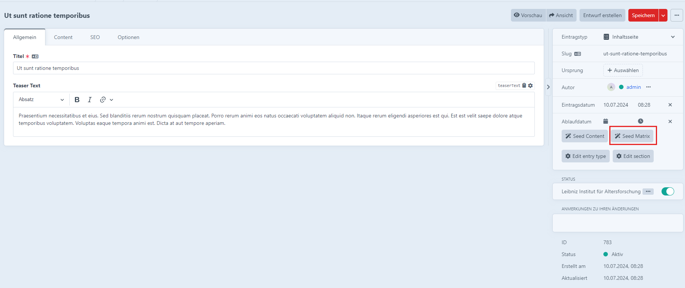
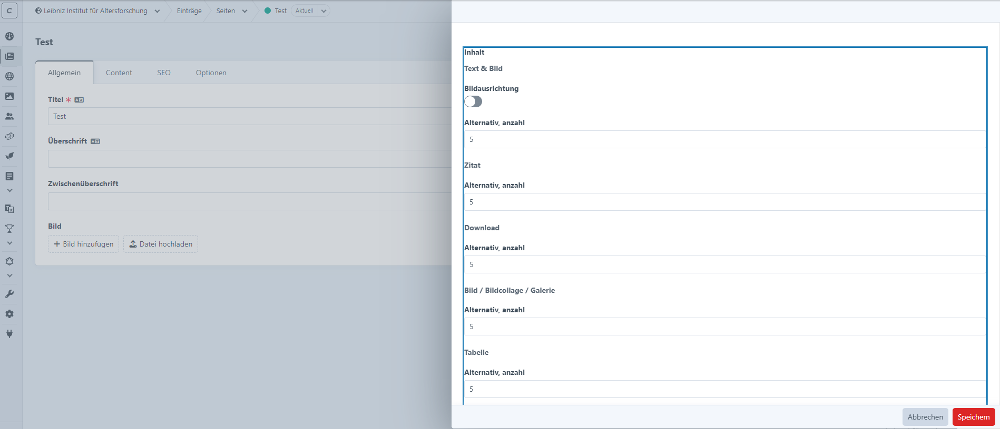
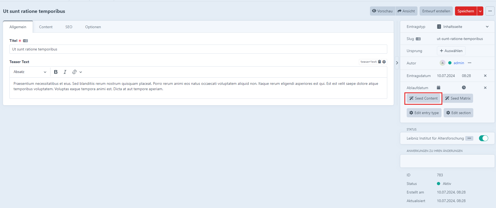
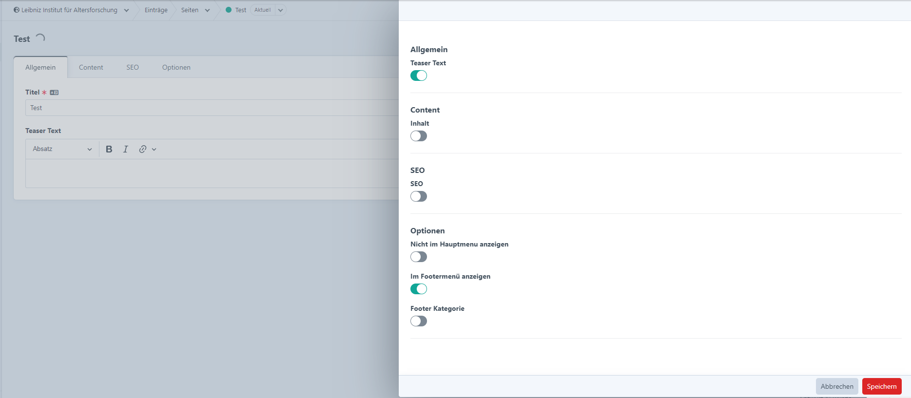

# Seeder plugin for Craft CMS

## Usage

Seeder allows you to quickly create dummy entries through the command line. And you can just as easily remove the dummy data when you're done building the site.
With the plugin installed, running `php craft element-seeder/generate/entries` create entries

## Installation

To install the plugin, follow these instructions.

1. Open your terminal and go to your Craft project:

        cd /path/to/project

2. Then tell Composer to load the plugin:

        composer require anubarak/craft-seeder

3. In the Control Panel, go to Settings → Plugins and click the “Install” button for "Seeder".

### Entries (Section ID/handle, count)

Use the command below, followed by the ``--section`` option and the ``--count`` of entries you want to create (defaults to 20 if ommited). This command works with both section ID and handle. 

```Shell
php craft element-seeder/generate/entries --section=news --count=15
```

## Clean up
Once you're done building out the site, the plugin gives you an easy way to remove the dummy data (entries, assets, categories and users). This can be done through the CP (click the Seeder section the sidebar) or through the command line with the following command:

```Shell
php craft element-seeder/clean-up
```

## Configuration options

you can include custom configurations for each layout

```php
<?php

use anubarak\seeder\models\EntryConfig;
use anubarak\seeder\models\FieldCallback;
use anubarak\seeder\models\Settings;
use craft\base\ElementInterface;
use craft\base\FieldInterface;

$config = (new Settings())
    ->fieldsConfig([
        new EntryConfig(
            'news',
            [
                (new FieldCallback('date'))
                    ->setCallable(
                        static function(
                            \Faker\Generator $faker,
                            FieldInterface   $field,
                            ElementInterface $element
                        ) {
                            return new DateTime();
                        }
                    ),
                (new FieldCallback('date2'))
                    ->setCallable(
                        static function(
                            \Faker\Generator $faker,
                            FieldInterface   $field,
                            ElementInterface $element
                        ) {
                            $date = (clone $element->getFieldValue('date'));
                            $date->modify('+1 day');

                            return $date;
                        }
                    ),
                (new FieldCallback('headline'))
                    ->setFakerMethod('text'),
            ]
        )
    ]);

// required for Craft since they'll do an array_merge
return $config->toArray([], ['fieldsConfig'], false);
```
Would create a custom callback while seeding fields for entries in the section `news` for fields 
`date`, `date2` and `text`. 
Text would call the `Faker` function `$faker->text` and `date` and `date2` would call the callback function in order to 
populate fields with custom conditions

## Populate Elements via CP

### Matrix with unique Value

When an entry has a matrix field you can populate these matrix fields with blocks or with unique values in case their field layout allows it.
For example when a block has a Dropdown field with 3 options and a Lightswitch field (with 2 options) you can generate 6 unique value combinations.
In that case it will automatically create 6 blocks with each combination. Otherwise it will create the number of blocks set in the number field





### Populate fields

Another option is to seed content in general.



You can choose which fields should be populated individually and Craft will seed it



### Populate multiple elements

The same can be done with multiple elements via element index


## Events

### Register Field Type Event

to include custom fields, you can use the `anubarak\seeder\events\RegisterFieldTypeEvent` event.

```php
\yii\base\Event::on(
    \anubarak\seeder\services\SeederService::class,
    \anubarak\seeder\services\SeederService::REGISTER_FIELD_TYPES,
    static function(\anubarak\seeder\events\RegisterFieldTypeEvent $event){
        $event->types['my\field\Class'] = MyCustomField::class;
    }
);
```
My Custom field could then look like the following
```php
use craft\base\ElementInterface;
use craft\base\FieldInterface;
use anubarak\seeder\services\fields\BaseField

class PlainText extends BaseField
{
    /**
     * @inheritDoc
     */
    public function generate(\craft\fields\PlainText|FieldInterface $field, ElementInterface $element = null)
    {
        if(!$field->multiline){
            return $this->factory->text($field->charLimit ?: 200);
        }

        return $this->factory->realText($field->charLimit ?: 200);
    }
}
```

### Register Unique Field Event

To register a unique field that should be able to the unique matrix fields

```php
\yii\base\Event::on(
    \anubarak\seeder\services\UniqueFields::class,
    \anubarak\seeder\services\UniqueFields::EVENT_REGISTER_UNIQUE_FIELDS,
    static function(\anubarak\seeder\events\RegisterUniqueFieldEvent $event){
        $event->fields[] = MyCustomUniqueField::class;
    }
);
```
```php
class DropdownUniqueField implements UniqueFieldInterface
{
    /**
     * @param \craft\fields\BaseOptionsField $field
     *
     * @inheritDoc
     */
    public function getDescription(Field $field): string
    {
        $options = [];
        foreach ($field->options as $option) {
            $options[] = '<code>' . $option['value'] . '</code>';
        }

        return 'Options: ' . join(' | ', $options);
    }

    /**
     * @param BaseOptionsField $field
     *
     * @inheritDoc
     */
    public function getValues(Field $field): array
    {
        $options = [];
        foreach ($field->options as $option) {
            $options[] = $option['value'];
        }

        return $options;
    }

    /**
     * @inheritDoc
     */
    public function getFieldClass(): string
    {
        return BaseOptionsField::class;
    }
}
```
You can take a look at the existing unique Fields